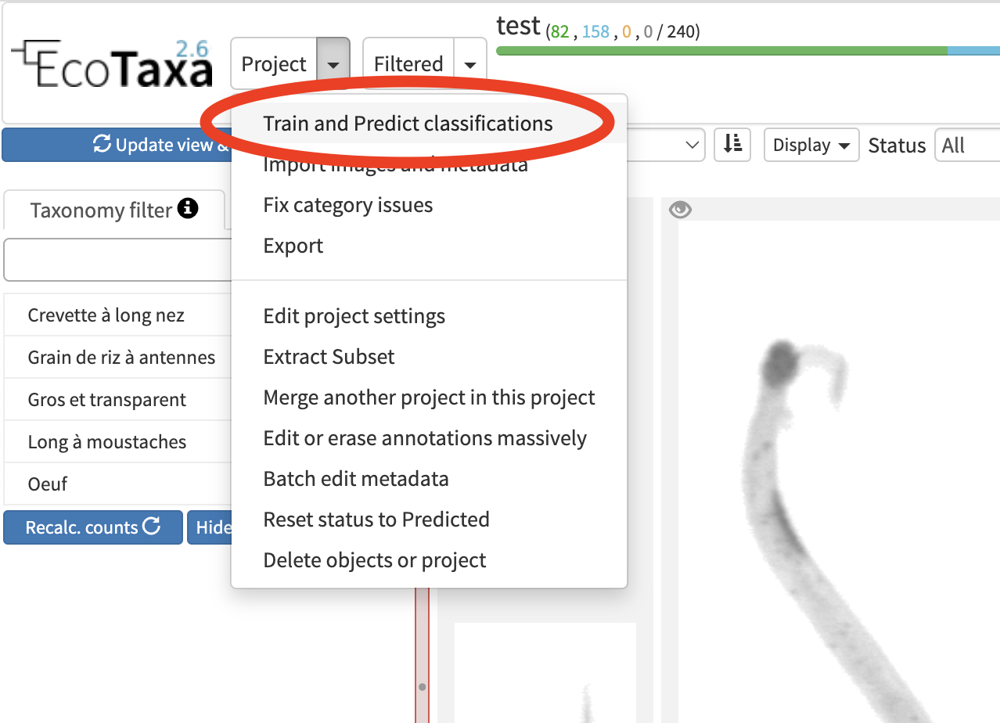
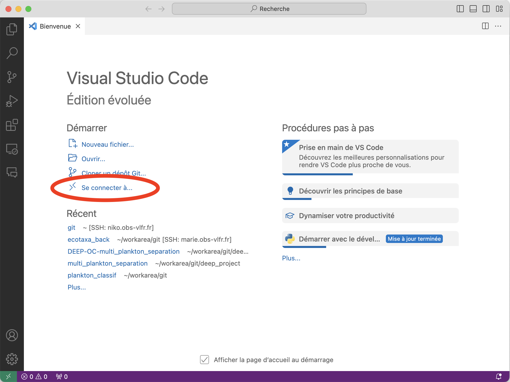
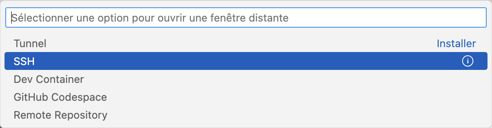
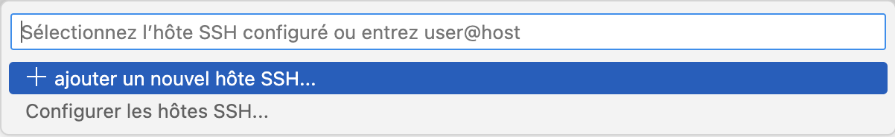
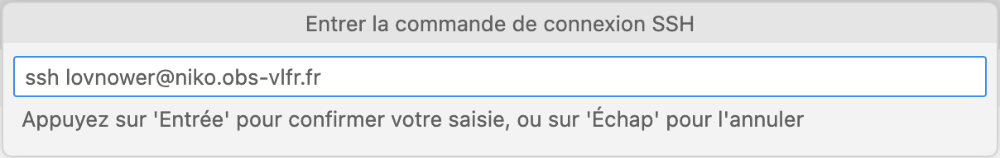
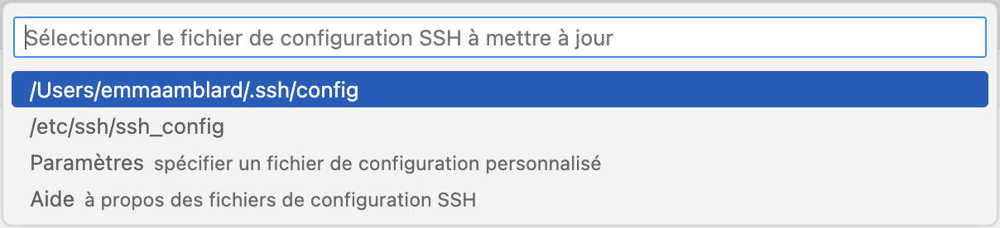
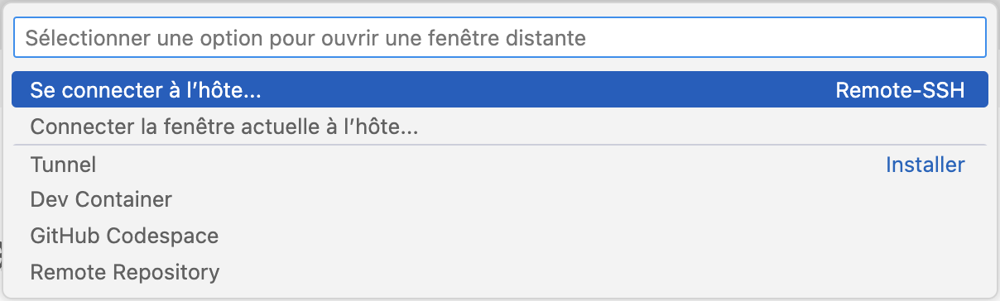
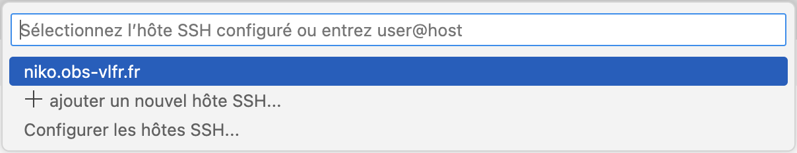
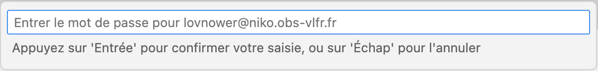
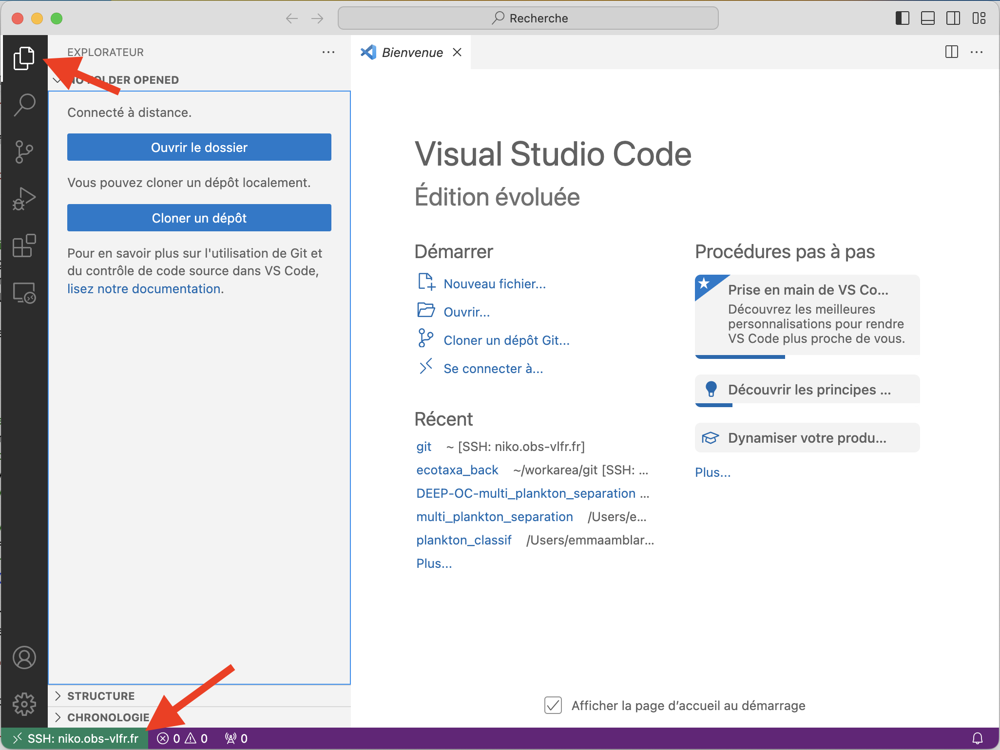

# Setting up an EcoTaxa development environment  
  
 - [Backend installation](#backend-installation)  
 - [Installation steps](#installation-steps)  
 - [Creating a database with docker](#creating-a-database-with-docker)  
 - [Launch the backend server](#launch-the-backend-server)  
 - [Frontend installation](#frontend-installation)  
 - [Installation steps](#installation-steps-1)  
 - [Launch the frontend server](#launch-the-frontend-server)  
 - [Launch tests](#launch-tests)  
 - [Backend tests](#backend-tests)  
 - [Import a test project](#import-a-test-project)  
 - [Installation for launching predictions](#installation-for-launching-prediction)  
 - [Libraries installation](#libraries-installation)  
 - [Launch a prediction](#launch-a-prediction)  
 - [Setup with VSCode on a remote machine](#setup-with-vscode-on-a-remote-machine)  
  
## Backend installation
  
The source code is in `ecotaxa_back/py/`, and requires python3.8.  
  
### Installation steps  
  
 -  Clone the back repository : https://github.com/ecotaxa/ecotaxa_back  
 - Creation of a virtual environment for back libraries  
```shell  
cd ~/ecotaxa_back/py
python3.8 -m venv myvenv
source myvenv/bin/activate

```  
 - Library installation (`libjpeg` is required for MacOS only)  
```shell  
pip3 install --upgrade pip wheel 
# brew install libjpeg  
pip3 install -r requirements.txt
```  
 - Creation of the configuration file `config.ini` from the template given in `~/ecotaxa_back/py/` :  
```shell  
cp config.ini.template config.ini
```  
 - Modification of `config.ini`, important entries being :  
```ini  
# DB connectivity, the user must be able to read / write every PG object there  
DB_USER = postgres  
DB_PASSWORD = mysecretpassword  
DB_HOST = localhost  
DB_PORT = 5432  
DB_DATABASE = ecotaxa  
  
[...]  
  
my_dir = ..  
# Where all images are stored. r/w by the back-end.  
VAULT_DIR = %(my_dir)s/vault  
# One subdirectory here per job. r/w by the back-end.  
JOBS_DIR = %(my_dir)s/temptask  
# The directory where files can be read by everyone. ro by the back-end.  
SERVERLOADAREA = %(my_dir)s/srv_fics  
# Sub-directory of previous (or not), for exports. r/w by the back-end.  
FTPEXPORTAREA = %(my_dir)s/ftp  
# CNN models. ro by the back-end.  
MODELSAREA = %(my_dir)s/models  
```  
Without access to an existing PostreSQL database, a new one must be created (see next section).  
You must also create the folders corresponding to the paths given in `config.ini`.  
  
### Creating a database with docker
#### if no postgresql installed    
```shell
sudo apt-get update  
sudo apt-get install -y postgresql-client 
``` 
 - Creating the docker database container
```shell  
docker run -d -p 5432:5432 --name ecotaxa_db -e POSTGRES_PASSWORD=mysecretpassword -v `pwd`/pg_data:/var/lib/postgresql/data pgvector/pgvector:pg14  
```  
NB : `docker logs -f ecotaxa_db` allows to monitor the logs of the database created.  
 - install vim  
```shell
docker exec -it ecotaxa_db /bin/bash  
apt-get update  
apt-get install vim 
```    
- edit pg_hba.conf
```shell
cd /var/lib/postgresql/data  
vi pg_hba.conf  #remplacer scram-sha-256 par md5  
vi postgresql.conf #remplacer password_encryption scram-sha-256 par md5  
```
- Create an empty database (see `config.ini`)  
```shell  
PYTHONPATH=. python cmds/manage.py db create --password mysecretpassword --db-name ecotaxa  
```  
- Filling the base with default data 
```shell
PYTHONPATH=. python cmds/manage.py db build  
```  
This command will create an administrator account whose credentials are given in `~/ecotaxa_back/py/cmds/manage.py` (THE_ADMIN and THE_ADMIN_PASSWORD). To use them in the interface, you may need to ensure that THE_ADMIN is in the format of an e-mail address, as it is checked in the frontend.      
  
### Launch the backend server 
  
Once the installations are complete, the server is launched with uvicorn :  
```shell
cd ~/ecotaxa_back/py
source myvenv/bin/activate
python3.8 run.py uvicorn
```  
If the last command returns the error `[Errno 98] Address already in use`, then run it with a new value for the APP_PORT environment variable (which is 8000 by default), for example :  
```shell  
APP_PORT=8097 python3.8 run.py uvicorn  
```  
  
## Frontend installation
  
### Installation  steps
  
- Clone the frontend repository https://github.com/ecotaxa/ecotaxa_front  
- Creating a virtual environment for frontend libraries  
```shell  
cd ~/ecotaxa_front
python3.8 -m venv venv --without-pip
source venv/bin/activate
```  
- Install libraries with a modified version of pip  : https://bootstrap.pypa.io/get-pip.py  
```shell  
wget https://bootstrap.pypa.io/get-pip.pypython3.8 get-pip.pypython3.8 -m pip install -r requirements.txt
```  
- Create a `config.cfg` file in `~/ecotaxa_front/config/` with the following contents (update `BACKEND_URL` with the correct value of `APP_PORT` if necessary) :  
``` ini  
# Flask application debug, set to True to see more traces  
DEBUG = True  
# The key is used for signing exchanges b/w navigator and present server (cookies)  
SECRET_KEY = 'THIS KEY MUST BE CHANGED'  
BACKEND_URL = 'http://localhost:8000'  
ECOPART_URL = 'http://localhost:5002'  
APP_GUI_MESSAGE_FILE = "app_gui_messages.json"  
```  
  
### Launch the frontend server  
  
Once the installations are done, the launch script is in `runserver.py`  
  
```shell  
cd ~/ecotaxa_front
source venv/bin/activate
python3.8 runserver.py
```  
The application can be accessed at the address given in the script logs :  
```  
[...]  
 WARNING: This is a development server. Do not use it in a production deployment. * Running on http://193.50.102.43:5001/ (Press CTRL+C to quit)
 ```  
Note: Running the frontend dev command in the dev_gui directory launches the backend server and frontend server
### Frontend development 
- install  npm
 ```npm install
 ```    
- edit [package.json](https://github.com/ecotaxa/ecotaxa_front/blob/master/dev_gui/package.json) add -P pathto/ecotaxa_back` if ecotaxa_back local repo is not  ../ecotaxa_back  
- *old Interface*  
   ```shell
   ./run_ecotaxa.sh  
   ```
   ( - B docker to user docker ecotaxa_db , -P path/to/ecotaxa_back if ecotaxa_back local dev repo is not ../ecotaxa_back)  
- New interface (which is being deployed since 2023-Q4)    
```shell
cd ecotaxa_front/dev_gui
```  
- development  (runs ecotaxa_back run.py and ecotaxa_front runserver.py with webpack watch)
```shell
 npm run dev
```
 *style.css , the bundle main.js --> appli/static/src/main.js (for dev js and css are included in js) *   
- production  
```shell
npm run build 
```
build before launching docker creation, dist files are in appli/static/gui/dist. 
Add them to github before launching a docker build_prod 
- Internationalization : 
instructions for messages update are in messages/README.md 
- 
### Internationalization
Please see the short install and update documentation [https://github.com/ecotaxa/ecotaxa_front/blob/master/messages/gui/readme.md] (messages/gui/readme.md)

## Launch tests  
  
### Backend test
  
- Creation of a temporary test database  

- if no postgresql installed 
```shell  
sudo apt-get update  
sudo apt-get install -y postgresql-client
```  
- docker image synchronized with the production version of postgresql  
```shell
docker run --name ecotaxa_tox -p 5440:5432 -d -e POSTGRES_PASSWORD=yourpassword -e POSTGRES_DB=ecotaxa pgvector/pgvector:pg14 
``` 
- edit pg_hba.conf  
```shell
installer vim  
docker exec -it ecotaxa_tox /bin/bash  
apt-get update  
apt-get install vim cd /var/lib/postgresql/data  
vi pg_hba.conf  #remplacer scram-sha-256 par md5  
vi postgresql.conf #remplacer password_encryption scram-sha-256 par md5  
```
- next time use 
```shell
 docker start ecotaxa_tox  
```  
- Launching tests with tox  
```shell
cd ~/ecotaxa_back/QA/py
PYTHONPATH=. POSTGRES_HOST=localhost POSTGRES_PORT=5440 tox  
```  
- Once the tests are complete, the temporary database can be stopped.  
```shell 
docker stop ecotaxa_tox#docker rm ecotaxa_tox  
```  
  
The swagger <ROOTURL>/docs page can be used to test endpoints without too much configuration effort.  
  
## Import a test project  
  
To start filling an empty database, you can import a test project from an EcoTaxa export.  
  
- To obtain an export to be reinserted :  
  create an export backup job of a project ( the menu appears when "settings" has been clicked on the projects list) 
  
The resulting .zip export should be placed in the folder given for `SERVERLOADAREA` in `config.ini` (`~/srv_fics` in our example) or uploaded via the myfiles entrypoint or "import from My Files" in the frontend.
  
- For data import to work, the taxonomy must be synchronized. You can do this by clicking on the warning popup that appears when you're connected (if clicking on “Synchronize to check EcoTaxa version” sends you to an error page, check in `config.ini` that you have set `TAXOSERVER_URL = http://ecotaxoserver.obs-vlfr.fr`).  
  
- You can then create a project by clicking on “Create project” on top of the projects list page. To import data into the new project :    
  
	- Select "General Import" then "Import from My Files" or “Choose a folder or zip file on the server” (the export.zip file 	should appear in the list) then click on “Select to import” and submit the form.  
   
A question will be asked during import to map the users mentioned in the export archive to the users present in this local version of EcoTaxa. Simply answer “Application Administrator” for each name to complete the import.  
  
## Installation for launching predictions
  
To be able to run predictions, you need to run the `gpu_jobs_runner.py` script, which requires libraries that are not part of the requirements already installed. The best solution is to create a new virtual environment.    
  
## Librairies installation  
  
- Virtual environment creation  
```shell
cd ~/ecotaxa_back/pypython3.8 -m venv gpu_venvsource gpu_venv/bin/activate
```  
- Installation of the libraries required for `gpu_jobs_runner.py`.  
```shell
pip3 install --upgrade pip wheelpip3 install -r gpu_jobs_reqs.txt
```  
  
## Launch a prediction  
  
- Running the script  
```shell  
cd ~/ecotaxa_back/py
source gpu_venv/bin/activate
python3.8 gpu_jobs_runner.py
```  
If this returns an error concerning protobuf, then you can `export PROTOCOL_BUFFERS_PYTHON_IMPLEMENTATION=python` and run again.  
  
- Once the script has run, you can make a prediction using the classification interface  
  
  
  
# Setup with VSCode on a remote machine  
  
- Installer Visual Studio Code : https://code.visualstudio.com/  
- On the VSCode home page, select “Connect to...” to open a login form at the top of the page.  
  
  
  
- Select “SSH” (this will automatically install the extensions required by VSCode)  
  
  
  
- Add an SSH host as follows 
  
  
  
  
  
  
  
- Once the host has been added, you can reopen the connection form and select it to connect to it.  
  
  
  
  
  
  
  
- This will open a new home page on the remote machine (you can check this by looking at the bottom-left indicator), and you can start exploring files using the top-left tab.  
  

