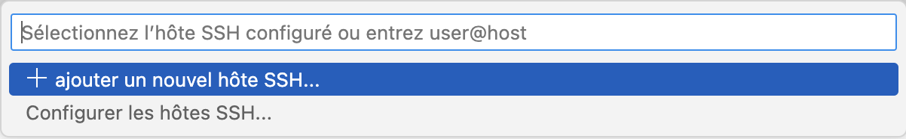
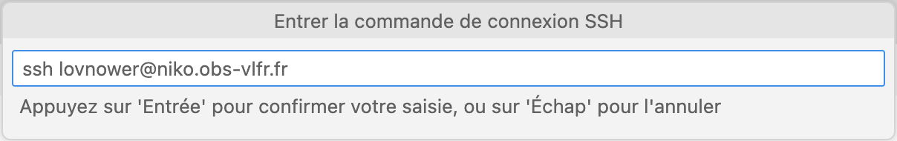
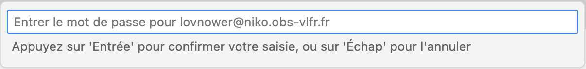
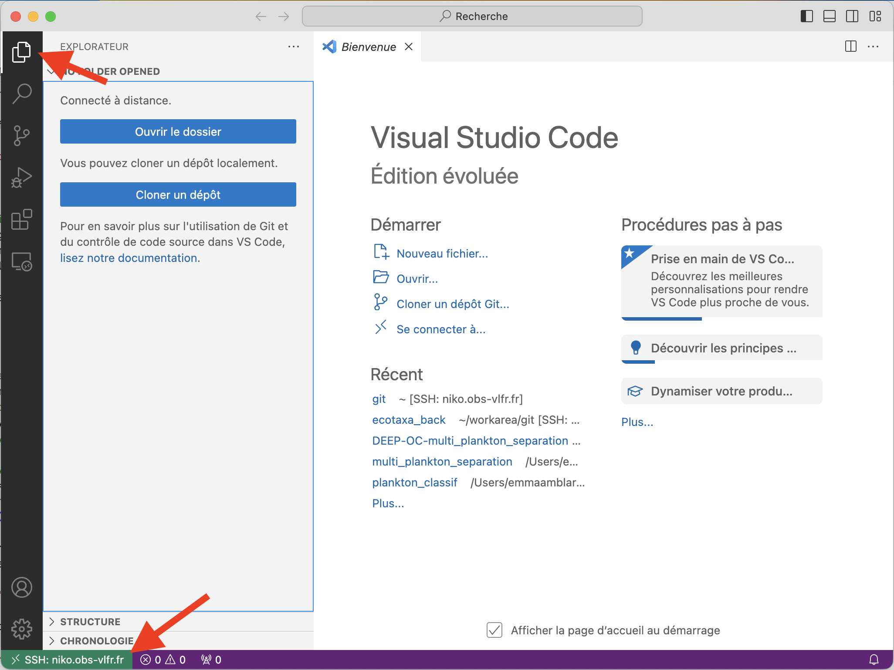

# Installation d'un environnement de développement EcoTaxa

- [Installation du backend](#installation-du-backend)
  - [Étapes d'installation](#étapes-dinstallation)
  - [Création d'une base de données avec docker](#création-dune-base-de-données-avec-docker)
  - [Lancement du serveur du back](#lancement-du-serveur-du-back)
- [Installation du frontend](#installation-du-frontend)
  - [Étapes d'installation](#c3a9tapes-dinstallation-1)
  - [Lancement du serveur du front](#lancement-du-serveur-du-front)
- [Lancement des tests](#lancement-des-tests)
  - [Tests du back](#tests-du-back)
- [Import d'un projet de test](#import-dun-projet-de-test)
- [Installations pour lancer des prédictions](#installations-pour-lancer-des-prédictions)
  - [Installation des librairies](#installation-des-librairies)
  - [Lancement d'une prédiction](#lancement-dune-prédiction)
- [Setup avec VSCode sur une machine distante](#setup-avec-vscode-sur-une-machine-distante)

## Installation du backend

Le code source est dans `ecotaxa_back/py/`, et nécessite python3.8.

### Étapes d'installation

- Cloner le repository du back : https://github.com/ecotaxa/ecotaxa_back
- Création d'un environnement virtuel pour les librairies du back
```shell
cd ~/ecotaxa_back/py
python3.8 -m venv myvenv
source myvenv/bin/activate
```
- Installation des librairies (`libjpeg` est requis sous MacOS uniquement)
```shell
pip3 install --upgrade pip wheel
# brew install libjpeg
pip3 install -r requirements.txt
```
- Création du fichier de configuration `config.ini` à partir du template donné dans `~/ecotaxa_back/py/` :
```shell
cp config.ini.template config.ini
```
- Modification de `config.ini`, les entrées importantes étant : 
```ini
# DB connectivity, the user must be able to read / write every PG object there
DB_USER = postgres
DB_PASSWORD = mysecretpassword
DB_HOST = localhost
DB_PORT = 5432
DB_DATABASE = ecotaxa

[...]

my_dir = ..
# Where all images are stored. r/w by the back-end.
VAULT_DIR = %(my_dir)s/vault
# One subdirectory here per job. r/w by the back-end.
JOBS_DIR = %(my_dir)s/temptask
# The directory where files can be read by everyone. ro by the back-end.
SERVERLOADAREA = %(my_dir)s/srv_fics
# Sub-directory of previous (or not), for exports. r/w by the back-end.
FTPEXPORTAREA = %(my_dir)s/ftp
# CNN models. ro by the back-end.
MODELSAREA = %(my_dir)s/models
```
Sans accès à une base de données PostreSQL existante, il faut en créer une nouvelle (cf section suivante).
Il faut également créer les dossiers correspondant aux chemins donnés dans `config.ini`.

### Création d'une base de données avec docker

- Création du conteneur docker de la base de données
```shell
docker run -d -p 5432:5432 --name ecotaxa_db -e POSTGRES_PASSWORD=mysecretpassword -v `pwd`/pg_data:/var/lib/postgresql/data postgres:13.6
```
NB : `docker logs -f ecotaxa_db` permet de suivre les logs de la base créée.
- Création d'une base de données vide (utilise `config.ini`)
```shell
PYTHONPATH=. python cmds/manage.py db create --password mysecretpassword --db-name ecotaxa
```
- Remplissage de la base avec des données par défaut
```
PYTHONPATH=. python cmds/manage.py db build
```
Cette commande va notamment créer un compte administrateur dont les identifiants sont donnés dans `~/ecotaxa_back/py/cmds/manage.py` (THE_ADMIN et THE_ADMIN_PASSWORD). Pour les utiliser dans l'interface, il faut peut-être s'assurer que THE_ADMIN soit au format d'une adresse mail, car il est vérifié dans le front.

### Lancement du serveur du back

Une fois les installations faites, le serveur est lancé avec uvicorn : 
```shell
cd ~/ecotaxa_back/py
source myvenv/bin/activate
python3.8 run.py uvicorn
```
Si la dernière commande renvoie l'erreur `[Errno 98] Address already in use`, alors il faut la lancer avec une nouvelle valeur pour la variable d'environnement APP_PORT (qui est de 8000 par défaut), par exemple :
```shell
APP_PORT=8097 python3.8 run.py uvicorn
```

## Installation du frontend

### Étapes d'installation

- Cloner le repository du front https://github.com/ecotaxa/ecotaxa_front
- Création d'un environnement virtuel pour les librairies du front
```shell
cd ~/ecotaxa_front
python3.8 -m venv venv --without-pip
source venv/bin/activate
```
- Installation des librairies avec une version modifiée de pip : https://bootstrap.pypa.io/get-pip.py
```shell
wget https://bootstrap.pypa.io/get-pip.py
python3.8 get-pip.py
python3.8 -m pip install -r requirements.txt
```
- Créer un fichier `config.cfg` dans `~/ecotaxa_front/config/` avec le contenu suivant (mettre à jour `BACKEND_URL` avec la bonne valeur de `APP_PORT` si besoin) :
```ini
# Flask application debug, set to True to see more traces
DEBUG = True
# The key is used for signing exchanges b/w navigator and present server (cookies)
SECRET_KEY = 'THIS KEY MUST BE CHANGED'
BACKEND_URL = 'http://localhost:8000'
ECOPART_URL = 'http://localhost:5002'
APP_GUI_MESSAGE_FILE = "app_gui_messages.json"
```

### Lancement du serveur du front

Une fois les installations faites, le script de lancement est dans `runserver.py`

```shell
cd ~/ecotaxa_front
source venv/bin/activate
python3.8 runserver.py
```
L'application est accessible à l'adresse qui est donnée dans les logs du script : 
```
[...]
   WARNING: This is a development server. Do not use it in a production deployment.
 * Running on http://193.49.112.43:5001/ (Press CTRL+C to quit)
```

## Lancement des tests

### Tests du back

- Création d'une base de données temporaire pour les tests
```shell
docker run --name ecotaxa_tox -p 5440:5432 -d -e POSTGRES_PASSWORD=postgres12 -e POSTGRES_DB=ecotaxa4 postgres:13.6
```
- Lancement des tests avec tox
```shell
cd ~/ecotaxa_back/QA/py
PYTHONPATH=. POSTGRES_HOST=localhost POSTGRES_PORT=5440 tox
```
Une fois les tests terminés, il faut supprimer la base de données temporaire
```shell
docker stop ecotaxa_tox
docker rm ecotaxa_tox
```

# Import d'un projet de test

Pour commencer à remplir une base de données vide, on peut importer un projet de test à partir d'un export EcoTaxa.

- Pour obtenir un export à réinsérer : 


L'export.zip obtenu doit être placé dans le dossier donné pour `SERVERLOADAREA` dans `config.ini` (`~/srv_fics` dans notre exemple).

- Pour que l'import des données fonctionne, il faut avoir fait la synchronisation de la taxonomie. On peut la faire à partir de la page "Contribute to a project" (si cliquer sur "Synchronize to check EcoTaxa version" renvoie vers une page d'erreur, vérifier dans `config.ini` qu'on a bien `TAXOSERVER_URL = http://ecotaxoserver.obs-vlfr.fr`).


- On peut ensuite créer un projet en cliquant sur "Create a new project" dans la même page. Pour importer des données dans le nouveau projet :


- Sélectionner "Choose a folder or zip file on the server" (le fichier export.zip devrait apparaître dans la liste) puis cliquer sur "Start import Images and TSV files".


Une question sera posée pendant l'import pour faire le mapping entre les utilisateurs mentionnés dans l'archive d'export, et les utilisateurs présents dans cette version locale d'EcoTaxa. Il suffit de répondre "Application Administrator" pour chaque nom pour terminer l'import.

# Installations pour lancer des prédictions

Pour pouvoir lancer des prédictions, il faut lancer le script `gpu_jobs_runner.py` qui nécessite des librairies ne faisant pas partie des requirements déjà installés. La meilleure solution est donc de créer un nouvel environnement virtuel.

## Installation des librairies

- Création de l'environnement virtuel
```shell
cd ~/ecotaxa_back/py
python3.8 -m venv gpu_venv
source gpu_venv/bin/activate
```
- Installation des librairies nécessaires à  `gpu_jobs_runner.py`
```shell
pip3 install --upgrade pip wheel
pip3 install -r gpu_jobs_reqs.txt
```

## Lancement d'une prédiction

- Lancement du script
```shell
cd ~/ecotaxa_back/py
source gpu_venv/bin/activate
python3.8 gpu_jobs_runner.py
```
Si cela renvoie une erreur concernant protobuf, alors on peut faire `export PROTOCOL_BUFFERS_PYTHON_IMPLEMENTATION=python` et relancer.

- Une fois que le script est lancé, on peut faire une prédiction à partir de l'interface de classification


# Setup avec VSCode sur une machine distante

- Installer Visual Studio Code : https://code.visualstudio.com/
- Sur l'accueil de VSCode, sélectionner "Se connecter à..." pour ouvrir un formulaire de connexion en haut de la page.


- Sélectionner "SSH" (cela installera automatiquement les extensions nécessaires à VSCode)


- Ajouter un hôte SSH en suivant les indications successives






- Une fois l'hôte ajouté, on peut ré-ouvrir le formulaire de connexion et le sélectionner pour s'y connecter




- Cela ouvrira un nouvel accueil sur la machine distante (on peut le vérifier avec l'indication en bas à gauche), on peut commencer à explorer les fichiers avec l'onglet en haut à gauche


